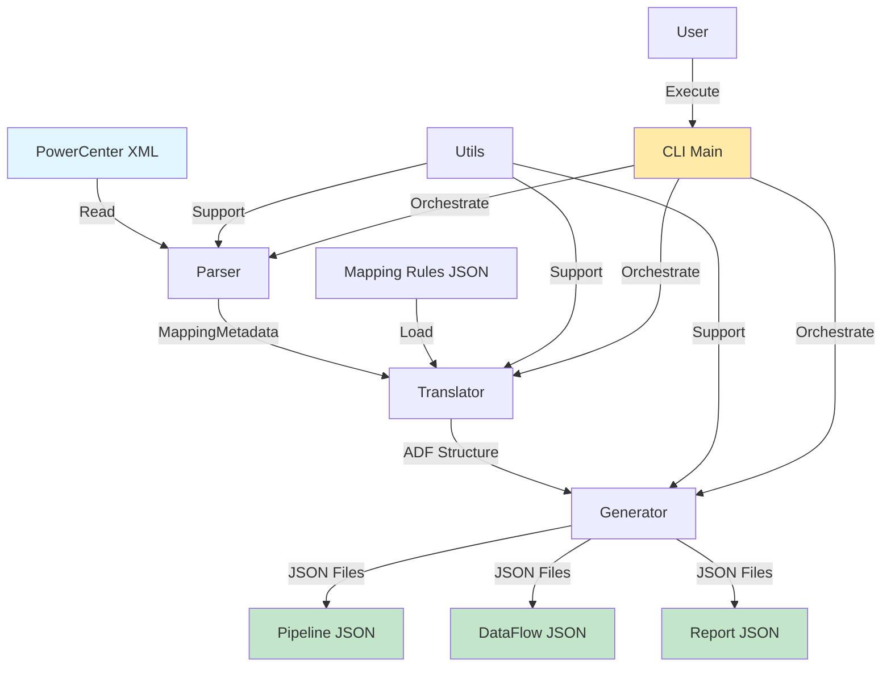

# Arquitectura del Sistema - PowerCenter to ADF Migrator

Documentación técnica de la arquitectura y diseño del sistema.

---

## Visión General

El sistema está diseñado siguiendo el patrón **Pipeline Pattern** con tres etapas principales:

```
┌─────────────┐     ┌──────────────┐     ┌─────────────┐
│   Parser    │────▶│  Translator  │────▶│  Generator  │
│  (XML→OBJ)  │     │  (PC→ADF)    │     │  (OBJ→JSON) │
└─────────────┘     └──────────────┘     └─────────────┘
```

---

## Flujo de Datos Completo



---

## Componentes del Sistema

### 1. CLI Principal (`main.py`)

**Responsabilidad:** Orquestar el flujo de migración completo

**Funciones Clave:**
- `parse_arguments()`: Procesa argumentos de línea de comandos
- `run_migration()`: Ejecuta el pipeline completo
- `display_summary()`: Muestra resultados formateados
- `main()`: Punto de entrada principal

**Dependencias:**
- `argparse`: Parsing de argumentos
- `rich`: Output formateado y colorizado
- `logging`: Sistema de logs

**Flujo de Ejecución:**
```python
main()
  ├─▶ parse_arguments()
  ├─▶ setup_logging()
  └─▶ run_migration()
      ├─▶ validate_file_path()
      ├─▶ parse_powercenter_xml()
      ├─▶ PowerCenterToADFTranslator.translate_mapping()
      ├─▶ ADFGenerator.generate_all()
      └─▶ display_summary()
```

---

### 2. Parser (`parser.py`)

**Responsabilidad:** Parsear archivos XML de PowerCenter y extraer metadata

**Clases de Datos:**
```python
@dataclass
class TransformField:
    name: str
    datatype: str
    precision: int
    scale: int
    expression: Optional[str]
    description: Optional[str]

@dataclass
class Transformation:
    name: str
    type: str
    description: Optional[str]
    fields: List[TransformField]
    properties: Dict[str, Any]

@dataclass
class Source:
    name: str
    database_type: str
    table_name: Optional[str]
    fields: List[TransformField]
    properties: Dict[str, Any]

@dataclass
class Target:
    # Similar a Source
    ...

@dataclass
class Connector:
    from_instance: str
    to_instance: str
    from_fields: List[str]
    to_fields: List[str]

@dataclass
class MappingMetadata:
    name: str
    description: Optional[str]
    version: str
    sources: List[Source]
    targets: List[Target]
    transformations: List[Transformation]
    connectors: List[Connector]
    properties: Dict[str, Any]
```

**Clase Principal:**
```python
class PowerCenterXMLParser:
    def parse_file(xml_file: Path) -> MappingMetadata
    def _extract_mapping_name() -> str
    def _extract_sources() -> List[Source]
    def _extract_targets() -> List[Target]
    def _extract_transformations() -> List[Transformation]
    def _extract_fields(parent_elem) -> List[TransformField]
    def _extract_transformation_properties(trans_elem, trans_type) -> Dict
    def _extract_connectors() -> List[Connector]
```

**Tecnologías:**
- `lxml`: Parsing XML eficiente
- `dataclasses`: Estructuras de datos inmutables
- `typing`: Type hints para claridad

**Decisiones de Diseño:**

1. **Uso de Dataclasses**: Inmutabilidad y claridad en estructuras de datos
2. **lxml vs xml.etree**: lxml es más rápido y robusto para XMLs grandes
3. **Separación de responsabilidades**: Cada método privado extrae un componente específico

---

### 3. Translator (`translator.py`)

**Responsabilidad:** Traducir componentes de PowerCenter a Azure Data Factory

**Clase Principal:**
```python
class PowerCenterToADFTranslator:
    def __init__(mapping_rules_path: Optional[str])

    # Métodos públicos
    def translate_mapping(metadata: MappingMetadata) -> Dict[str, Any]
    def translate_source(source: Source) -> Dict[str, Any]
    def translate_target(target: Target) -> Dict[str, Any]
    def translate_transformation(trans: Transformation) -> Optional[Dict]
    def translate_expression(expression: str) -> str
    def map_datatype(pc_datatype: str) -> str
    def get_statistics() -> Dict[str, int]

    # Métodos privados (uno por tipo de transformación)
    def _translate_expression(trans, adf_type) -> Dict
    def _translate_filter(trans, adf_type) -> Dict
    def _translate_aggregator(trans, adf_type) -> Dict
    def _translate_joiner(trans, adf_type) -> Dict
    def _translate_sorter(trans, adf_type) -> Dict
    def _translate_source_qualifier(trans, adf_type) -> Dict
    def _translate_router(trans, adf_type) -> Dict
    def _translate_lookup(trans, adf_type) -> Dict
```

**Estructura de Mapping Rules:**
```json
{
  "transformations": {
    "Source Qualifier": "Source",
    "Expression": "DerivedColumn",
    ...
  },
  "functions": {
    "TO_DATE": "toDate",
    "SUBSTR": "substring",
    ...
  },
  "datatypes": {
    "decimal": "Int32",
    "varchar2": "String",
    ...
  }
}
```

**Patrón de Diseño: Strategy Pattern**

Cada tipo de transformación tiene su propio método de traducción, permitiendo:
- Extensibilidad: Agregar nuevos tipos fácilmente
- Mantenibilidad: Lógica aislada por tipo
- Testing: Testear cada tipo independientemente

**Manejo de Expresiones:**
```python
def translate_expression(expression: str) -> str:
    # 1. Traducir funciones usando regex
    for pc_func, adf_func in function_mappings.items():
        pattern = re.compile(re.escape(pc_func), re.IGNORECASE)
        expression = pattern.sub(adf_func, expression)

    # 2. Traducir operadores
    expression = expression.replace('||', '+')  # Concatenación
    expression = expression.replace('!=', '<>')  # Diferente

    return expression
```

**Decisiones de Diseño:**

1. **Configuración externa (JSON)**: Permite modificar reglas sin cambiar código
2. **Strategy Pattern**: Flexibilidad para agregar transformaciones
3. **Acumulación de warnings/errors**: No fallar inmediatamente, reportar al final
4. **Case-insensitive matching**: PowerCenter no es case-sensitive en funciones

---

### 4. Generator (`generator.py`)

**Responsabilidad:** Generar archivos JSON válidos para Azure Data Factory

**Clase Principal:**
```python
class ADFGenerator:
    def __init__(output_dir: str)

    # Métodos públicos
    def generate_pipeline(name, translated_structure) -> str
    def generate_dataflow(name, translated_structure) -> str
    def generate_report(name, translated_structure, original_metadata) -> str
    def generate_all(name, translated_structure, original_metadata) -> Dict[str, str]
    def validate_json(json_file, schema) -> bool
    def get_generated_files() -> List[str]

    # Métodos privados
    def _generate_recommendations(translated_structure) -> List[str]
```

**Estructura de Archivos Generados:**

**Pipeline JSON:**
```json
{
  "name": "pipeline_[nombre]",
  "properties": {
    "description": "...",
    "activities": [
      {
        "name": "ExecuteDataFlow",
        "type": "ExecuteDataFlow",
        "typeProperties": {
          "dataFlow": {
            "referenceName": "dataflow_[nombre]"
          },
          "compute": {
            "coreCount": 8,
            "computeType": "General"
          }
        }
      }
    ],
    "annotations": ["Migrado desde PowerCenter..."]
  }
}
```

**DataFlow JSON:**
```json
{
  "name": "dataflow_[nombre]",
  "properties": {
    "type": "MappingDataFlow",
    "typeProperties": {
      "sources": [...],
      "transformations": [...],
      "sinks": [...]
    },
    "annotations": ["..."]
  }
}
```

**Report JSON:**
```json
{
  "mapping_name": "...",
  "migration_date": "2025-01-23T...",
  "statistics": {
    "total_transformations": 10,
    "migrated_transformations": 8,
    "success_rate": 80.0,
    "warnings": 2,
    "errors": 0
  },
  "warnings": [...],
  "errors": [...],
  "recommendations": [...]
}
```

**Validación JSON:**
- Usar `jsonschema` para validar estructura
- Verificar sintaxis JSON válida
- Opcional: validar contra schema de ADF (futuro)

**Decisiones de Diseño:**

1. **Timestamps en nombres**: Evitar sobrescritura accidental
2. **Separación de concerns**: Un método por tipo de archivo
3. **Pretty printing**: JSON legible para revisión manual
4. **Reporte detallado**: Facilita debugging y seguimiento

---

### 5. Utilidades (`utils.py`)

**Responsabilidad:** Funciones helper reutilizables

**Funciones Principales:**

```python
# Logging
def setup_logging(verbose: bool, log_file: Optional[str]) -> Logger

# File I/O
def validate_file_path(file_path: str, extension: str) -> Path
def create_output_directory(output_dir: str) -> Path
def save_json(data: Dict, file_path: str, pretty: bool) -> None
def load_json(file_path: str) -> Dict

# Formateo
def sanitize_name(name: str) -> str
def format_timestamp() -> str
def print_banner() -> None

# Estadísticas
def calculate_migration_stats(
    total_transformations: int,
    migrated_transformations: int,
    warnings: int,
    errors: int
) -> Dict[str, Any]

# Excepciones custom
class MigrationError(Exception)
class ValidationError(Exception)
```

**Decisiones de Diseño:**

1. **Funciones puras**: No mantienen estado, fáciles de testear
2. **Type hints**: Claridad en inputs/outputs
3. **Excepciones custom**: Identificar errores específicos del dominio
4. **Logging estructurado**: Facilita debugging en producción

---

## Patrones de Diseño Aplicados

### 1. Pipeline Pattern

**Aplicación:**
```
Input → Parser → Translator → Generator → Output
```

**Beneficios:**
- Separación clara de responsabilidades
- Fácil agregar stages (ej: validador adicional)
- Testing independiente de cada stage

### 2. Strategy Pattern

**Aplicación:**
Traducción de transformaciones según tipo

**Beneficios:**
- Extensibilidad sin modificar código existente
- Lógica encapsulada por tipo
- Facilita testing unitario

### 3. Factory Pattern (implícito)

**Aplicación:**
Creación de objetos de datos (Sources, Transformations, etc.)

**Beneficios:**
- Construcción consistente de objetos
- Validación centralizada

### 4. Dependency Injection

**Aplicación:**
```python
class PowerCenterToADFTranslator:
    def __init__(self, mapping_rules_path: Optional[str] = None):
        # Inyectar configuración externa
        self.mapping_rules = load_json(mapping_rules_path)
```

**Beneficios:**
- Testing con configuraciones mock
- Flexibilidad en producción vs desarrollo

---

## Flujo de Ejecución Detallado

### Etapa 1: Inicialización

```
Usuario ejecuta: pc-to-adf input.xml --output ./adf_output
    │
    ▼
main() - src/main.py
    │
    ├─▶ parse_arguments()
    │   └─ Retorna: Namespace(input_file='input.xml', output='./adf_output', ...)
    │
    ├─▶ setup_logging(verbose=False, log_file=None)
    │   └─ Configura logger global
    │
    └─▶ print_banner()
        └─ Muestra header ASCII
```

### Etapa 2: Parsing

```
run_migration()
    │
    ├─▶ validate_file_path('input.xml', '.xml')
    │   ├─ Verifica existencia
    │   ├─ Verifica extensión
    │   └─ Retorna: Path object
    │
    └─▶ parse_powercenter_xml('input.xml')
        │
        ├─▶ PowerCenterXMLParser()
        │   └─ Inicializa parser
        │
        └─▶ parser.parse_file(xml_file)
            │
            ├─▶ lxml.etree.parse(xml_file)
            │   └─ Crea árbol XML
            │
            ├─▶ _extract_mapping_name()
            │   └─ Extrae nombre del mapping
            │
            ├─▶ _extract_sources()
            │   ├─ Itera sobre <SOURCE> elements
            │   ├─ Para cada source:
            │   │   ├─ Crea objeto Source
            │   │   └─ _extract_fields(source_elem)
            │   └─ Retorna: List[Source]
            │
            ├─▶ _extract_targets()
            │   └─ Similar a sources
            │
            ├─▶ _extract_transformations()
            │   ├─ Itera sobre <TRANSFORMATION> elements
            │   ├─ Para cada transformation:
            │   │   ├─ Crea objeto Transformation
            │   │   ├─ _extract_fields(trans_elem)
            │   │   └─ _extract_transformation_properties(trans_elem, type)
            │   └─ Retorna: List[Transformation]
            │
            ├─▶ _extract_connectors()
            │   └─ Extrae <CONNECTOR> elements
            │
            └─▶ Retorna: MappingMetadata object
```

### Etapa 3: Traducción

```
PowerCenterToADFTranslator.translate_mapping(metadata)
    │
    ├─▶ __init__(mapping_rules_path)
    │   ├─ load_json('config/mapping_rules.json')
    │   └─ Inicializa mappings (transformations, functions, datatypes)
    │
    ├─▶ translate_source(source) para cada source
    │   ├─ map_datatype() para cada campo
    │   └─ Retorna: Dict con estructura ADF
    │
    ├─▶ translate_transformation(trans) para cada transformation
    │   ├─ Busca tipo en transformation_mappings
    │   ├─ Si soportado:
    │   │   ├─ Llama método específico (_translate_expression, etc.)
    │   │   ├─ translate_expression() para cada expresión
    │   │   └─ Retorna: Dict con transformación ADF
    │   └─ Si no soportado:
    │       ├─ Agrega warning
    │       └─ Retorna: None
    │
    ├─▶ translate_target(target) para cada target
    │   └─ Similar a translate_source
    │
    └─▶ Retorna: Dict {
        'name': ...,
        'sources': [...],
        'transformations': [...],
        'sinks': [...],
        'warnings': [...],
        'errors': [...]
    }
```

### Etapa 4: Generación

```
ADFGenerator.generate_all(name, translated_structure, metadata)
    │
    ├─▶ generate_pipeline(name, translated_structure)
    │   ├─ Construye estructura de pipeline JSON
    │   ├─ save_json(pipeline, output_dir + 'pipeline_*.json')
    │   └─ Retorna: ruta del archivo
    │
    ├─▶ generate_dataflow(name, translated_structure)
    │   ├─ Construye estructura de dataflow JSON
    │   │   ├─ Procesa sources
    │   │   ├─ Procesa transformations
    │   │   └─ Procesa sinks
    │   ├─ save_json(dataflow, output_dir + 'dataflow_*.json')
    │   └─ Retorna: ruta del archivo
    │
    ├─▶ generate_report(name, translated_structure, metadata)
    │   ├─ calculate_migration_stats(...)
    │   ├─ _generate_recommendations(translated_structure)
    │   ├─ Construye reporte JSON
    │   ├─ save_json(report, output_dir + 'migration_report_*.json')
    │   └─ Retorna: ruta del archivo
    │
    └─▶ Retorna: Dict {
        'pipeline': 'path/to/pipeline.json',
        'dataflow': 'path/to/dataflow.json',
        'report': 'path/to/report.json'
    }
```

### Etapa 5: Presentación

```
display_summary(mapping_name, stats, files, warnings, errors)
    │
    ├─▶ Rich Panel: "Migración completada"
    ├─▶ Rich Table: Estadísticas
    ├─▶ Rich Table: Archivos generados
    ├─▶ Lista de warnings (primeros 5)
    ├─▶ Lista de errores (primeros 5)
    └─▶ Panel: Próximos pasos
```

---

## Manejo de Errores

### Jerarquía de Excepciones

```
Exception
    │
    ├─▶ MigrationError
    │   └─ Errores durante traducción/generación
    │
    └─▶ ValidationError
        └─ Errores de validación de entrada
```

### Estrategia de Manejo

1. **Fail Fast**: Validación de inputs al inicio
2. **Tolerancia a Fallos**: Continuar migración aunque algunas transformaciones fallen
3. **Reporting**: Acumular warnings y errors para reporte final
4. **Logging**: Todos los errores se logguean para debugging

**Ejemplo:**
```python
try:
    adf_trans = translate_transformation(transformation)
except MigrationError as e:
    # No detener migración
    logger.error(f"Error en {transformation.name}: {e}")
    errors.append(str(e))
    continue  # Continuar con siguiente transformación
```

---

## Testing

### Estrategia de Testing

```
tests/
├── test_parser.py         # Tests unitarios del parser
├── test_translator.py     # Tests unitarios del translator
├── test_generator.py      # Tests unitarios del generator
└── test_integration.py    # Tests de integración (futuro)
```

### Fixtures Reutilizables

```python
@pytest.fixture
def sample_xml(tmp_path):
    """Crea XML de prueba"""
    xml_content = """<?xml version="1.0"?>..."""
    xml_file = tmp_path / "test.xml"
    xml_file.write_text(xml_content)
    return xml_file

@pytest.fixture
def translator():
    """Crea instancia del traductor"""
    return PowerCenterToADFTranslator()
```

### Coverage Objetivo

- **Parser**: 90%+
- **Translator**: 85%+
- **Generator**: 85%+
- **Utils**: 95%+
- **Overall**: 85%+

---

## Performance y Optimización

### Bottlenecks Identificados

1. **Parsing XML**: Para archivos muy grandes (>10MB)
   - **Solución**: lxml es eficiente, considerar SAX parsing si es necesario

2. **Regex en traducción de expresiones**: Múltiples regex.sub()
   - **Solución**: Compilar regex una vez en __init__

3. **Escritura de JSON**: Para proyectos con muchos mappings
   - **Solución**: Ya usa escritura directa, suficiente para v1.0

### Métricas de Performance

**Objetivo v1.0:**
- Mapping simple (5-10 transformaciones): < 1 segundo
- Mapping complejo (20-30 transformaciones): < 3 segundos
- Archivo XML grande (5MB): < 10 segundos

---

## Extensibilidad

### Agregar Nueva Transformación

**Pasos:**

1. **Actualizar `config/mapping_rules.json`:**
```json
{
  "transformations": {
    "Union": "Union"  // Agregar mapeo
  }
}
```

2. **Agregar método en `translator.py`:**
```python
def _translate_union(self, trans: Transformation, adf_type: str) -> Dict:
    return {
        'name': trans.name,
        'type': adf_type,
        'unionType': 'all'
    }
```

3. **Registrar método:**
```python
translation_methods = {
    ...
    'Union': self._translate_union
}
```

4. **Agregar tests:**
```python
def test_translate_union_transformation(translator):
    trans = Transformation(name="UN_Merge", type="Union")
    result = translator.translate_transformation(trans)
    assert result['type'] == 'Union'
```

### Agregar Nueva Función

**Actualizar `mapping_rules.json`:**
```json
{
  "functions": {
    "TO_CHAR": "toString"
  }
}
```

No requiere cambios de código - el traductor es data-driven.

---

## Seguridad

### Consideraciones

1. **Validación de XML**: Usar lxml con protección contra XML bombs
2. **Path Traversal**: Validar que paths de output no escapen del directorio
3. **Inyección**: Expresiones se traducen pero no se ejecutan
4. **Credentials**: No se procesan credenciales, solo estructura

**Implementado:**
```python
def validate_file_path(file_path: str, extension: str) -> Path:
    path = Path(file_path)

    # Prevenir path traversal
    if '..' in path.parts:
        raise ValueError("Path traversal no permitido")

    # Verificar extensión
    if path.suffix != extension:
        raise ValueError(f"Extensión incorrecta: {path.suffix}")

    return path
```

---

## Deployment

### Package Distribution

**setup.py configurado para:**
- Instalación vía pip
- Entry point: `pc-to-adf`
- Dependencias automáticas

**Instalación:**
```bash
pip install pc-to-adf
```

**Uso:**
```bash
pc-to-adf input.xml
```

---

## Roadmap Técnico

### v1.1 (Q2 2025)
- Soporte para Router completo
- Lookup con cache básico

### v2.0 (Q3 2025)
- Update Strategy → Alter Row automático
- Sequence Generator con múltiples estrategias
- Mapplets como Data Flows reutilizables
- Workflows → Pipelines

### v2.1 (Q4 2025)
- Deployment automático a Azure
- Validación de datos post-migración
- Interfaz web básica

---

## Referencias

- [PowerCenter XML Schema](https://docs.informatica.com)
- [Azure Data Factory REST API](https://docs.microsoft.com/azure/data-factory)
- [lxml Documentation](https://lxml.de)
- [Python Type Hints](https://docs.python.org/3/library/typing.html)

---

**Última actualización**: Enero 2025
**Versión del documento**: 1.0
**Autor**: Equipo Técnico Entix
